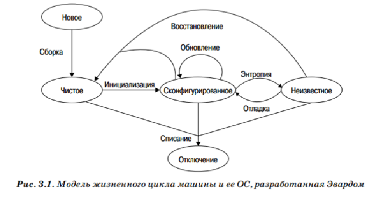

# Глава 3. Рабочие станции.

Обслуживание операционных систем на рабочих станциях сводится к выполнению трех основных задач: первоначальная установка системного программного обеспечения и приложений, обновление системного программного обеспечения и приложений, настройка сетевых параметров. Мы называем эти задачи «большой тройкой».

Рабочая станция в нашем понимании – компьютерное оборудование, выделенное для работы одного пользователя. Как правило, имеется в виду настольный компьютер или ноутбук пользователя. В современной сети у нас также есть среди  прочего  компьютеры  с  удаленным  доступом,  виртуальные  машины и ноутбуки с док-станциями.

Рабочие станции, как правило, используются в больших количествах и отличаются долгим жизненным циклом (рождение, использование, смерть).

Новое состояние относится к совершенно новой машине.

- Чистое состояние относится к машине с установленной, но еще не настроенной ОС.
- Сконфигурированное состояние  означает,  что  система  настроена  и  функционирует должным образом.
- Неизвестное состояние относится к компьютеру, который был неправильно 
сконфигурирован или конфигурация которого устарела.
- Отключенное состояние относится к машине, которая была списана и отключена.

Энтропия– процесс нежелательной амортизации, приводящий компьютер в неизвестное состояние, которое можно исправить с помощью отладки.

Процесс восстановления – это процесс, при котором данные на машине стираются, и система заново устанавливается, возвращая машину к сконфигурированному состоянию.

Архитектурное решение, принятое системным администратором, может усилить или ослабить целостность операционной системы.

Установка вручную всегда предполагает возможность ошибок. Если ошибки возникают в процессе установки, узел сети начнет свой жизненный цикл с тенденцией к разрушению. Если процесс установки полностью автоматизирован, новые рабочие станции будут развернуты должным образом.

Переустановка (процесс восстановления) подобна установке с той разницей, что в первом случае, возможно, понадобится перенести старые данные и приложения.

В этой главе термин платформа используется для обозначения определенной комбинации поставщика оборудования и ОС. Вот некоторые примеры: персональный компьютер с процессором AMD Athlon под управлением Windows Vista, Mac с процессором PPC под управлением OS X 10.4, настольный компьютер с процессором Intel Xeon под управлением Ubuntu 6.10 Linux, Sun Sparc Ultra 40 под управлением Solaris 10 или Sun Enterprise 10000 под управлением Solaris 9. В некоторых компаниях компьютеры от разных поставщиков под управлением одной и той же операционной системы могут считать разными платформами.

# 3.1. Основы

С обслуживанием операционных систем рабочей станции связаны три критически важных аспекта:

1.  Первоначальная установка системного ПО и приложений.
2.  Обновление системного ПО и приложений.
3.  Настройка сетевых параметров.

Не всегда просто автоматизировать некоторые процессы. Когда поставщики пытаются продать нам новую продукцию, мы всегда интересуемся, можно ли автоматизировать ее работу и как это сделать.

# 3.1.1. Установка ОС

Автоматизация решает огромное количество проблем, но не все из них являются техническими. 

Во-первых, автоматизация экономит деньги. Разумеется, одним из основных преимуществ является время, выигранное за счет замены ручных процессов автоматическими. Кроме того, автоматизация устраняет два вида скрытых затрат. 

Первый относится к ошибкам: при ручном выполнении процессов существует вероятность ошибок. Второй тип скрытых затрат относится к неоднородности. Если вы вручную устанавливаете операционную систему, вы никогда не добьетесь той же конфигурации на другой машине.

Второй тип скрытых затрат относится к неоднородности. Если вы вручную устанавливаете операционную систему, вы никогда не добьетесь той же конфигурации на другой машине.

# 3.1.1.1. Удостоверьтесь, что ваша автоматизированная система действительно автоматизирована

Самый важный аспект автоматизации заключается в том, что установка должна быть полностью автоматизирована.

Процедуру, требующую возвращения человека посреди установки для ответа на тот или иной вопрос, нельзя назвать полностью автоматизированной, и она теряет эффективность.

Когда вы решите, что закончили автоматизацию того или иного процесса, попросите опробовать вашу систему какого-нибудь человека, незнакомого с вашей работой. Проинструктируйте его одним предложением и больше ему не помогайте. Если у него возникнут проблемы, значит, вам необходимо улучшить данный аспект вашей системы. Повторяйте эту процедуру до тех пор, пока ваш помощник не сможет самостоятельно использовать систему.

# 3.1.1.2. Частично автоматизированная установка

Частичная автоматизация лучше, чем ее полное отсутствие. До тех пор пока система установки не будет работать идеально, необходимо обеспечить какие-то временные средства для некоторых этапов. Автоматизация оставшегося 1% может занять больше времени, чем автоматизация первых 99%.

Основная временная мера – документирование всего процесса, которое позволит впоследствии воспроизводить его в точности.

Можно автоматизировать различные этапы установки. Некоторые из них отлично поддаются автоматизации.

# 3.1.1.3. Клонирование и другие методы

В некоторых сетях для создания новых машин используется клонирование жестких дисков. Клонирование жесткого диска подразумевает создание узла с точной конфигурацией ПО, которая необходима для всех развертываемых узлов. Затем жесткий диск этого узла клонируется (копируется) на все новые компьютеры. Первую машину часто называют «золотым узлом». Вместо того чтобы снова и снова копировать жесткий диск, его содержимое можно скопировать на компакт-диск, ленточный накопитель или файловый сервер, которые впоследствии будут использоваться при установке.

Мы предпочитаем автоматизированный процесс установки копированию диска по нескольким причинам. Во-первых, если по аппаратному обеспечению новая машина значительно отличается от старой, необходимо создать отдельный мастер-образ. Даже при отсутствии воображения можно представить себе огромное количество мастер-образов, которое может понадобиться в итоге. И наконец, наличие резервных машин для каждого типа оборудования, требующего новых образов, значительно повышает расходы и усилия, необходимые для установки.

Поставщики некоторых ОС не поддерживают клонированные диски, так как процесс установки может изменяться на основе таких факторов, как тип обнаруженного оборудования.Можно достичь золотой середины, применяя как автоматизацию, так и клонирование.

Некоторые поставщики ОС не предоставляют возможности автоматизировать установку. Однако можно найти способы усовершенствовать этот процесс.

# 3.1.1.4. Стоит ли доверять установкам от поставщиков

Переустановка ОС с нуля предпочтительнее по нескольким причинам. Во-первых, прежде чем машина сможет работать в вашей сети, вам, вероятно, потребуется установить другие приложения и локализации поверх установленной поставщиком ОС. Автоматизация всего процесса установки с нуля зачастую проще, чем установка приложений и конфигурирование предустановленной ОС. Во-вторых, поставщики вносят изменения в конфигурацию предустановленной ОС в собственных целях, никого об этом не уведомляя. Установка с нуля дает вам известное состояние каждой машины. Использование предустановленной ОС означает отклонения от вашей стандартной конфигурации. Порой эти отклонения могут вызвать проблемы.

Другая причина для отказа от использования предустановленной ОС – то, что время от времени ОС узлов сети приходится переустанавливать.

# 3.1.1.5. Контрольные списки при установке

Какой бы способ установки ОС вы ни использовали – ручной или полностью автоматизированный, – вы можете улучшить согласованность процесса с помощью контрольных списков. Эти списки помогают удостовериться, что техники не пропустят ни одного этапа. Польза таких списков очевидна, если процесс установки полностью выполняется вручную.

Даже если процесс установки ОС полностью автоматизирован, грамотный контрольный список все же может принести пользу. Некоторые действия невозможно автоматизировать, так как их необходимо выполнить физически (например, запустить процесс установки; удостовериться, что мышь работает; протереть экран монитора; предоставить пользователю на выбор несколько ковриков для мыши).

# 3.1.2. Обновление системного ПО и приложений

Системы обновления ПО должны быть достаточно универсальными, чтобы они позволяли устанавливать новые приложения и обновлять уже имеющиеся, а также устанавливать патчи ОС. Если система способна только устанавливать патчи, новые приложения можно упаковать и использовать их в качестве патчей. Такие системы также можно использовать для внесения незначительных изменений на большом количестве узлов сети. Небольшие изменения конфигурации, такие как новый файл /etc/ntp.conf, можно упаковать в патч и установить автоматически. Большинство систем позволяет включать постустановочные скрипты – программы, которые при запуске выполняют изменения, необходимые для установки пакета. Для внесения сложных изменений можно даже создать отдельный пакет, содержащий только постустановочный скрипт.

# 3.1.2.1. Процесс обновления отличается от установки

Автоматизация обновления ПО схожа с автоматизацией первичной установки, но между ними есть и несколько существенных различий.

- _Узел сети находится в рабочем состоянии._ Обновление устанавливается на машины, которые находятся в рабочем состоянии, а при первичной установке необходимо выполнить ряд дополнительных задач, таких как создание разделов на дисках и определение сетевых параметров.
- _Узел сети находится в офисе._ Система обновления должна быть способна выполнять задачи в собственной сети узла.
- _Отсутствует необходимость в физическом доступе._ При обновлении ПО нет необходимости в физическом доступе к рабочей станции (что может помешать работе пользователей). Физический  доступ  к  компьютерам автоматизировать нельзя.
- _Узел сети уже используется._ Обновление ПО проводится на машинах, которые используются на протяжении какого-то времени.
- _Узел сети может не находиться в «известном состоянии»._ Поэтому автоматизация должна быть более точной, так как с момента первичной установки в ОС могли возникнуть ошибки.
- _Узел сети может использоваться сотрудниками в процессе обновления._ Некоторые обновления невозможно установить в то время, когда машина используется.
- _Узел сети может отсутствовать._ В эпоху ноутбуков есть большая вероятность того, что узел не присутствует в сети в момент установки обновлений.
- _Узел сети может иметь мультисистемную загрузку._ В эпоху узлов с  мультисистемной  загрузкой  система  обновления,  предназначенная  для настольных компьютеров, должна точно контролировать доступ к нужной ОС.

# 3.1.2.2. Одна, несколько, много

Вы можете снизить риск ошибок обновления, применив метод «одна, несколько, много».

- __Одна.__ Прежде всего установите патч на одну машину. Лучше всего на свою собственную – тогда у вас будет дополнительный стимул все сделать правильно. Если при обновлении возникнут ошибки, вносите в процесс изменения до тех пор, пока он не будет работать на одной машине без ошибок.
- __Несколько.__ Далее попробуйте установить патч на несколько других машин. Если это возможно, стоит протестировать автоматизированный процесс обновления  на  рабочих  станциях  остальных  системных  администраторов, прежде чем задействовать машины пользователей. Системные администраторы проявляют чуть больше понимания. Затем протестируйте систему на нескольких  машинах  дружелюбно  настроенных  к  вам  пользователей  (не системных администраторов).
- __Много.__ Протестировав свою систему и убедившись, что она не уничтожит ничей  жесткий  диск,  начинайте  постепенно  переходить  ко  все  большим и большим группам пользователей, нетерпимых к риску.

# 3.1.3. Конфигурирование сети

Третий компонент, необходимый для сетей, объединяющих большое количество рабочих станций, – это способ автоматизации обновления сетевых параметров– тех считанных битов информации, от которой часто зависит загрузка компьютеров и их объединение в сеть.

Наиболее распространенная система автоматизации этого процесса – DHCP.

# 3.1.3.1. Используйте шаблоны, а не конфигурируйте каждый отдельный узел

Системы DHCP должны иметь систему шаблонов. Некоторые системы DHCP хранят отдельные параметры, присвоенные каждому отдельному узлу сети. Другие системы DHCP хранят шаблоны, описывающие, какие параметры присваиваются узлам различных классов. Преимущество шаблонов в том, что при внесении изменений на множестве узлов вам нужно будет просто изменить шаблон, что значительно лучше, чем прокручивать длинный список узлов сети, пытаясь найти те, которые требуется изменить. Еще одно преимущество в том, что значительно уменьшается вероятность появления ошибки в синтаксисе, если конфигурационный файл генерируется программой. Исходя из того, что шаблоны синтаксически правильны, конфигурация тоже будет верной.

# 3.1.3.2. Когда применять динамическую аренду адресов

Как правило, DHCP назначает отдельный IP-адрес каждому узлу сети. Функция динамической аренды адресов позволяет вам указать диапазон IP-адресов, которые можно присваивать узлам сети. Эти узлы смогут при каждом подключении к сети получать новый IP-адрес. Преимущество в том, что облегчается работа администраторов и повышается удобство для пользователей.

Динамическое распределение следует использовать в случаях, когда много узлов конкурируют за малое количество IP-адресов. Типичная офисная локальная сеть лучше подходит для динамически назначаемой аренды.

Причина для назначения статических IP-адресов – повышение удобства использования файлов журнала. Использование только статических IP-адресов не является достаточной мерой для безопасности.

# 3.1.3.3. Использование DHCP в сетях общего пользования

Многие использовали подобные решения еще до изобретения стандарта 802.1x. Наверняка вы бывали в местах, где сеть была сконфигурирована следующим образом: в сеть выйти очень легко, но можно получить  доступ  только  к  веб-странице  авторизации.  После  авторизации (с помощью либо какого-то способа идентификации, либо платежа с кредитной карты) можно получить полный доступ. В таких ситуациях системные администраторы предпочитают решение plug-in-and-go (подключись-и-работай) для выделения пространства адресов, но при этом должна быть возможность проверки, есть ли у пользователей разрешение на использование ресурсов корпорации, университета или отеля.

# 3.1.4. Старайтесь не использовать динамический DNS -сервер с DHCP

Старайтесь не допускать ситуаций, в которых простые ошибки одних пользователей могут помешать работе других. Архитекторы локальной сети давно поняли это в отношении разрешения клиентам самим устанавливать IP-адреса. И нам не стоит повторять эту ошибку, позволяя клиентам выбирать собственные имена узлов. До появления DHCP пользователи часто «вешали» локальную сеть, случайно устанавливая IP-адрес, аналогичный IP-адресу маршрутизатора.

Использование DHCP в значительной мере снижает шанс повторения подобной ситуации. Разрешение клиентам устанавливать собственное имя узла – один из вариантов той же ситуации, который приведет к подобным результатам.

Динамический DNS-сервер с DHCP создает систему, которая является более запутанной, более сложной для управления, более подверженной сбоям и менее безопасной.

Ограничение распространения означает ограничение риска безопасности таким образом, чтобы он распространялся только в пределах определенной области. Рекомендуем ограничивать динамический DNS-сервер определенными сетевыми субдоменами, от которых не требуется высокая надежность.

# 3.1.4.1. Управление сроками аренды DHCP

Управление сроками аренды может помочь в распределении обновлений. DHCP-клиентам задается определенный набор параметров, который будет использоваться в течение определенного периода времени. По истечении этого периода они должны обновить свою аренду. Изменения вносятся во время обновления.

# 3.2. Тонкости

Как правило, рабочие станции – самые распространенные машины в компании. Любое, даже незначительное снижение нагрузки на поддержку рабочих станций имеет огромное значение.

# 3.2.1. Полная уверенность в завершении

Существуют автоматизированные процессы, но помимо этого есть и автоматизация процесса. Если мы абсолютно уверены в процессе, мы избавлены от необходимости беспокоиться об ошибках.

# 3.2.2. Вовлечение пользователей в процесс стандартизации

В идеале пользователи должны принимать участие в процессе разработки с самого начала. Назначенные представители или заинтересованные руководители могли бы выбирать приложения, которые будут включены в конфигурацию. Для каждого приложения составляется соглашение об уровне обслуживания, в ко-тором описывается уровень обслуживания со стороны системных администраторов. Новые версии ОС и приложений отслеживаются и одобряются. Контролируемое внедрение новых версий аналогично описанному автоматизированному процессу обновления.

Однако в реальности платформы контролируются либо руководством,  либо отделом системного администрирования, отвечающим за предоставление основной платформы, которую пользователи могут настраивать под себя. В первом случае примером может служить офис приема заказов по телефону, где операторы работают со строго определенным набором приложений. Системные администраторы совместно с руководством определяют, какие именно приложения будут установлены, когда именно будет проведено обновление и т. д.

Вторые случаи более распространенны. В одной сети стандартной платформой для персонального компьютера считается его операционная система; самые необходимые приложения; приложения, требуемые компанией-учредителем; утилиты, которые наиболее часто просят установить пользователи и которые можно лицензировать оптом. Такая среда является очень открытой.

Для некоторых приложений предусмотрены более формальные процессы.

# 3.2.3. Разнообразие стандартных конфигураций

Чем больше стандартных конфигураций используется в корпоративной сети, тем труднее все их обслуживать. Один из способов создать большое количество разнообразных конфигураций – использовать для всех конфигураций один и тот же сервер и механизмы, вместо того чтобы выделить отдельный сервер для каждого стандарта. Однако можно потратить время и создать единую обобщенную систему, способную производить множественные конфигурации и поддаваться масштабированию.

Общее понятие управляемых стандартизированных конфигураций часто носит название «управление конфигурацией программного обеспечения»(Software Configuration Management, SCM). Этот процесс относится как к серверам, так и настольным компьютерам.

Стандартные конфигурации также могут облегчить процесс обновления ОС.

# 3.3. Заключение

Настольные компьютеры, в отличие от серверов, как правило, развертываются в больших количествах, и все они обладают практически одной и той же конфигурацией. У каждого компьютера есть свой жизненный цикл, который начинается с установки ОС и заканчивается в тот момент, когда машину выключают в самый последний раз. В этот период программное обеспечение компьютера постепенно приходит в негодность в результате энтропии, обновляется и заново переустанавливается в начале нового цикла. В идеале все узлы сети, относящиеся к определенной платформе, в начале своего жизненного цикла должны иметь одну и ту же конфигурацию. Обновляться они должны параллельно. Некоторые стадии жизненного цикла важнее для пользователей, чем другие. Мы стремимся увеличить продолжительность более важных стадий и сократить продолжительность менее значительных.

Основу всего, чему посвящена данная глава, составляют три процесса:

1.	Первичная установка ОС должна быть автоматизирована.
2.	Обновление программного обеспечения должно быть автоматизировано.
3.	Конфигурация сети должна администрироваться централизованно с помощью такой системы, как DHCP.

Эти три задачи имеют критическое значение для экономного управления. Грамотное их выполнение позволит всем последующим процессам проходить более гладко.
___

# Глава 4. Серверы.

В отличие от рабочих станций, предназначенных для одного пользователя, от сервера зависит множество пользователей. Следовательно, главным приоритетом для них становится надежность и бесперебойная работа.

К серверу могут подключаться сотни, тысячи или даже миллионы пользователей. Все усилия по повышению производительности или надежности наталкиваются на барьер огромного количества пользователей. Cерверы рассчитываются на более продолжительное времени работы, чем рабочие станции, что также подразумевает дополнительные расходы. Покупка сервера с избыточной мощностью становится вложением в продление его срока жизни.

# 4.1. Основы

Оборудование, продаваемое как сервер, качественно отличается от оборудования, приобретаемого для индивидуальной рабочей станции. У серверного оборудования другие возможности, а при его разработке учитывается другая экономическая модель. При установке и поддержке серверов используются особые процедуры. Как правило, серверы поставляются с контрактом на обслуживание, системами резервного копирования, операционной системой и возможностью удаленного доступа. Кроме того, серверы размещают в вычислительных центрах с контролируемым микроклиматом и с ограниченным доступом к серверному оборудованию.

# 4.1.1. Покупайте для серверов серверное оборудование

Серверное оборудование обычно стоит дороже, но дополнительные возможности оправдывают вложения. Вот некоторые из этих возможностей:

- Расширяемость.
- Большая производительность	центральных процессоров.
- Высокопроизводительные системы обмена информацией (ввода-вывода).
- Возможности модернизации.
- Возможность монтирования	в стойку.
- Не требуется доступ с боковых сторон.
- Дополнения для повышенной надежности.
- Контракт на обслуживание.
- Альтернативные варианты управления.

# 4.1.2. Выбирайте поставщиков, известных надежностью продукции

Очень важно выбирать поставщиков, продукция которых известна своей надежностью.

Можно порекомендовать для общения два ресурса сообщества системных администраторов: SAGE (System Administrators’ Guild, Гильдия системных администраторов, www.sage.org) и LOPSA (League of Professional System Administrators, Лига профессиональных системных администраторов, www.lopsa.org).

Оборудование может быть однотипным (все от одного поставщика и/или из одной линейки продукции) или разнотипное (от разных поставщиков и/или из разных линеек продукции). Однотипное оборудование проще обслуживать, так как требуется меньше времени на подготовку; обслуживание и ремонт упрощаются за счет одного набора запасных частей, а также легче найти виновных в случае возникновения проблем. Однако разнотипное оборудование тоже имеет свое преимущество – оно заключается в том, что вы не зависите от одного поставщика, а конкуренция между поставщиками обернется для вас лучшим обслуживанием.

# 4.1.3. Реальные расходы на серверное оборудование

Чтобы иметь представление о дополнительных расходах на серверы, вы должны знать, из чего складывается цена компьютера.

У большинства поставщиков есть три серии продукции: для дома, для бизнеса и серверное оборудование. Домашняя серия обычно продается по наименьшей начальной цене, так как клиенты чаще всего принимают решение о покупке на основании рекламируемой цены. Настольные компьютеры для бизнеса обычно разрабатываются с учетом общих затрат в течение всего срока их службы. Начальная закупочная цена выше, чем для домашних компьютеров, но серия для бизнеса должна дольше не устаревать. Серверные серии обычно ориентированы на наилучшее соотношение себестоимости и производительности.

Неверно считать, что серверы дороже настольных компьютеров, так как это сравнение объектов разного рода.

Весомый аргумент против решения о приобретении дорогого сервера: его производительность выше, чем это требуется для службы.

# 4.1.4. Контракты на обслуживание и запасные компоненты

При покупке сервера продумайте, как будет происходить ремонт.

Вот несколько разумных сценариев, которые помогут вам при выборе подходящего контракта на обслуживание:

- Не критически важный сервер.
- Большая группа идентичных серверов.
- Постепенная модернизация.
- Важные узлы.
- Большое количество моделей от одного поставщика.
- Критически важный узел.

Нужно искать компромисс между хранением запасных частей и сервисным контрактом.

Есть три простых способа предотвратить забывание включения оборудования в контракт. Первый способ заключается в том, чтобы создать хорошую систему инвентаризации и использовать ее для перекрестного пересмотра контракта. Однако хорошую систему инвентаризации трудно найти, и даже лучшие из них могут пропустить несколько узлов.

Второй способ заключается в том, чтобы человек, ответственный за закупки, также отвечал за добавление новых машин в контракт. Этот человек должен знать, к кому обращаться для определения соответствующего уровня обслуживания. Если нет единого отдела закупок, можно попробовать найти какую-то другую процедуру добавления новых узлов в контракт.

Третий способ – решить общие проблемы, связанные с гарантией.

Контракты на обслуживание, скорее, борются с последствиями, а не предотвращают  проблемы.

Налаженный обмен новых компонентов на старые – важная часть оперативного ремонта, и в идеале она должна быть предусмотрена в контракте на обслуживание.

Старайтесь не иметь дело с поставщиками, которые продают серверы, но не предоставляют перекрестную доставку ни на каких условиях.

Еще больше сократить время на ремонт можно, приобретя комплект запасных компонентов, снимающий зависимость от поставщика при срочном ремонте сервера. В комплект должно входить по одному экземпляру каждого компонента системы.

# 4.1.5. Обеспечение целостности данных

На серверах хранятся критически важные данные и уникальные конфигурации, которые должны быть защищены.

Клиентские рабочие станции, как правило, серийные и с однотипными конфигурациями, а их данные обычно хранятся на серверах, что снимает необходимость в резервном копировании. Если откажет диск рабочей станции, ее конфигурация должна быть идентичной многочисленным аналогичным машинам и немодифицированной по отношению к исходному состоянию, а следовательно, она может быть восстановлена с помощью автоматизированной процедуры установки. Это в теории. Однако люди всегда сохраняют какие-то данные на своих локальных машинах, локально устанавливаются программы, а операционная система сохраняет локально некоторые конфигурационные данные. На Windows-платформах избежать этого невозможно. Переносимые профили сохраняют пользовательские настройки на сервере при каждом выходе из системы, но не защищают локально установленное программное обеспечение и настройки реестра машины.

# 4.1.6. Размещение серверов в вычислительном центре

Серверы должны устанавливаться в условиях с надежными энергоснабжением,  противопожарной защитой, сетью, охлаждением и физической безопасностью. Лучше всего зарезервировать физическое место для размещения сервера при его приобретении. Если пометить места в соответствующих стойках распечатанными метками, это предотвратит повторное резервирование места. Для разметки мест энергоснабжения и охлаждения потребуется сверяться по списку или таблице.

После сборки оборудование лучше устанавливать в стойку непосредственно перед установкой ОС и другого программного обеспечения.

# 4.1.7. Конфигурация клиент-серверной ОС

Серверы необязательно должны работать под управлением тех же ОС, что и их клиенты. Серверы могут быть совершенно другими, в точности такими же, или с той же базовой ОС, но с другой конфигурацией для иного предназначения. Иногда на серверах требуется устанавливать все те же программы, что и на клиентах.

# 4.1.8. Обеспечьте удаленный доступ через консоль

Для серверов необходима возможность удаленного обслуживания.

Переключатель КВМ– устройство, позволяющее нескольким машинам использовать одну клавиатуру, видеоэкран и мышь (КВМ). Предшественник переключателя КВМ был предназначен для устройств с последовательным портом.

В настоящее время последовательные консольные концентраторы бывают двух видов: самодельные и специализированные. Самодельное решение подразумевает следующее: вы берете машину с множеством последовательных портов и программное обеспечение (бесплатное, такое как ConServer, или коммерческий аналог) и сами создаете систему. Специализированное решение – готовая система от поставщика, которая обычно быстрее поддается настройке и оснащена программным обеспечением в виде прошивки или на твердотельном накопителе на флэш-памяти.

Последовательные консоли и переключатели КВМ дают следующее преимущество: они позволяют вам управлять системной консолью, если сеть не работает или если система в неисправном состоянии. Сетевые устройства, такие как маршрутизаторы и коммутаторы, оснащены только последовательными консолями.

Удаленный доступ к консолям позволяет системным администраторам снизить затраты и улучшить факторы безопасности. Машинные залы оптимизированы для машин, а не для людей. 

При покупке сервера следует убедиться в наличии возможности удаленного консольного доступа.

# 4.1.9. Зеркалирование загрузочных дисков

Загрузочный диск, или диск с операционной системой, как правило, труднее всего заменить в случае его повреждения. Поэтому необходимо соблюдать особые меры безопасности, чтобы ускорить процесс восстановления. Для загрузочного диска каждого сервера необходимо создать зеркальный диск.

Зеркалирование предполагает определенные компромиссы в отношении производительности. Операции чтения производятся быстрее, так как чтение идет параллельно с двух дисков.

Без зеркального копирования сбой жесткого диска означает простой в работе. Благодаря зеркальному копированию сбой жесткого диска является событием, которое можно не только спокойно пережить, но и контролировать. Если неисправный диск можно заменить во время работы системы, сбой в работе одного компонента не приведет к простою. Если неисправные диски можно заменять только при отключенной системе, перерыв в работе можно запланировать в соответствии с потребностями компании. Благодаря этому простои в работе можем контролировать мы, не позволяя им контролировать нас.

Зеркальное RAID-копирование защищает от сбоев оборудования. Оно не защищает от программных или пользовательских ошибок.

# 4.2. Тонкости
# 4.2.1. Повышение надежности и удобства обслуживания
# 4.2.1.1. Одноцелевые серверы

Одноцелевое устройство– устройство, созданное для выполнения одной конкретной задачи. Те же действия можно выполнять и с помощью универсальных устройств, но есть определенные преимущества при использовании устройств, предназначенных для качественного выполнения одной конкретной задачи.

Одноцелевой сервер представляет собой устройство, в котором воплотился многолетний опыт. Конструирование сервера – сложный процесс. Преимущество одноцелевых устройств – наличие возможностей, которых больше нигде нет.

# 4.2.1.2. Резервные блоки питания

По предрасположенности к сбоям среди всех системных компонентов на втором месте после жестких дисков находятся блоки питания. Поэтому в идеале серверы должны быть обеспечены резервными блоками питания.

Наличие резервных блоков питания не означает, что просто подключено два таких устройства. Это означает, что система сохраняет работоспособность, если один из блоков питания не функционирует: избыточность n + 1. В некоторых случаях системе при полной нагрузке требуется два блока питания для обеспечения достаточной мощности. В этом случае избыточность обеспечивается тремя блоками питания.

У каждого блока питания должен быть отдельный кабель питания. На практике самая распространенная причина проблем с питанием – случайно выдернутый из розетки кабель.

# 4.2.1.3. Полная избыточность, или n + 1

Избыточность n + 1относится к системам, которые спроектированы таким образом, что система продолжает функционировать даже после сбоя одного из компонентов. Примером такой системы являются RAID-массивы, которые продолжают полноценно функционировать даже после выхода из строя одного из дисков, или коммутатор Ethernet с дополнительной многовходовой системой коммутации, который позволяет передавать трафик даже после сбоя одного из сегментов системы коммутации.

При полной избыточности два полных набора оборудования объединены в отказоустойчивую конфигурацию. Первая система обеспечивает исполнение службы, а вторая бездействует в полной готовности взять на себя работу при сбое первой системы. Переключение на резервные мощности может осуществляться вручную (кто-то замечает сбой в первой системе и активирует вторую) или автоматически (вторая система отслеживает работу первой системы и сама активируется при ее отказе).

Другие системы с полной избыточностью используют распределение нагрузки. Обе системы полноценно функционируют и распределяют между собой рабочую нагрузку.

Если n равно или больше 2, n + 1 выгоднее, чем полная избыточность. Как правило, избыточность n + 1 используется только для серверных подсистем, а не для всех видов компонентов.

# 4.2.1.4. Компоненты, поддерживающие «горячую» замену

Резервные компоненты должны поддерживать «горячую» замену. «Горячая» замена подразумевает возможность отключить и заменить компонент во время работы системы.

Первое преимущество «горячей» замены – возможность устанавливать компоненты во время работы системы. При избыточности n + 1 система может перенести сбой только одного компонента. Именно поэтому критически важно как можно быстрее заменить нерабочий компонент, чтобы нейтрализовать риск двойного сбоя компонентов.

Компоненты с возможностью «горячей» замены повышают стоимость системы.

# 4.2.1.5. Раздельные сети для административных функций

Дополнительные сетевые интерфейсы на серверах позволяют создать раздельные административные сети.

# 4.2.2. Альтернатива: множество недорогих серверов

Способ разместить большое количество машин на ограниченном пространстве – использовать технологию блейд-серверов. Один корпус содержит множество ячеек, в каждую из которых можно подключить плату (блейд) с процессором и памятью. Корпус обеспечивает питание, доступ к сети и системе управления. В некоторых случаях каждая плата оснащена жестким диском. В других случаях у каждой платы должен быть доступ к центральной сети хранения данных. Так как все устройства схожи друг с другом, можно создать автоматизированную систему, которая позволяет заменить неисправное устройство свободным.

# 4.3. Заключение

Серверы, как и любое другое оборудование, иногда дают сбои, поэтому необходимо заключить контракт на обслуживание или составить план восстановления, а также предусмотреть возможность резервного копирования и восстановления данных. Серверы должны располагаться в специальных машинных залах, обеспечивающих условия для надежной работы. Пространство в машинном зале необходимо распределить до момента покупки, а не когда прибудет сервер. Кроме того, заранее необходимо спланировать электросеть, пропускную способность сети и систему охлаждения.

Одноцелевые серверы – аппаратные или программные системы, которые содержат все необходимое для выполнения определенной задачи: заранее сконфигурированное программное обеспечение, которое установлено на оборудовании, специально настроенном для конкретного приложения. Одноцелевые серверы представляют собой высококачественные решения, разработанные с учетом многолетнего опыта. Они, как правило, являются более надежными и простыми в управлении, чем менее профессиональные решения. Однако такие системы достаточно сложно настраивать для нетипичных требований корпоративной сети.

Серверам необходима возможность удаленного администрирования. Аппаратные или программные системы позволяют удаленно выполнять консольный доступ.

Для повышения надежности серверы часто оснащаются дополнительными системами, предпочтительно в конфигурации n + 1.